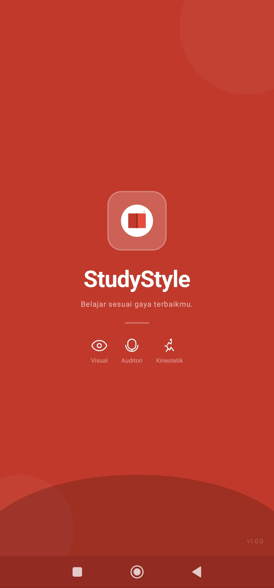
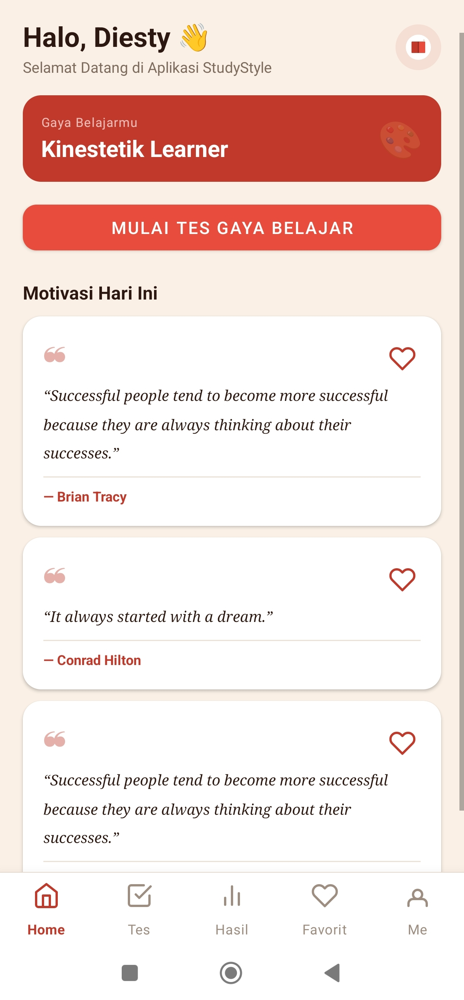
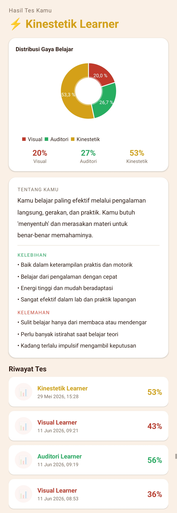
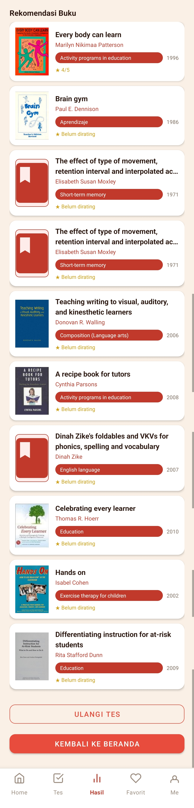
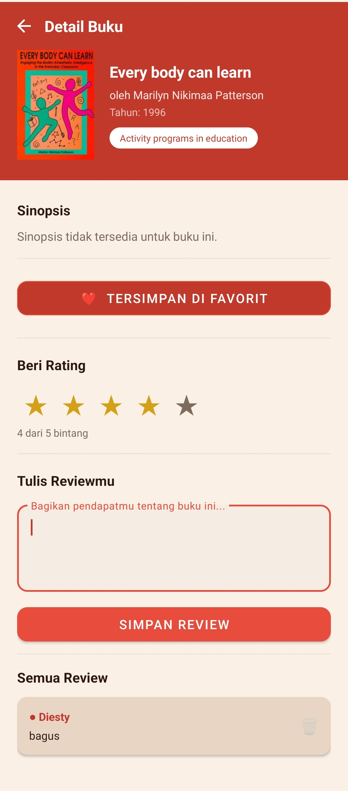
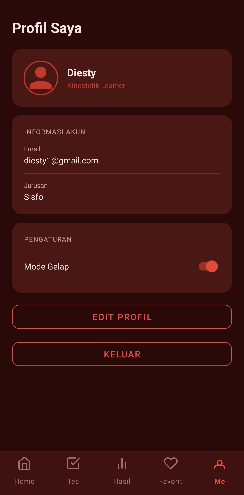
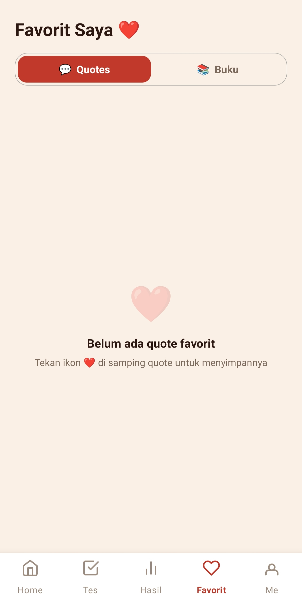
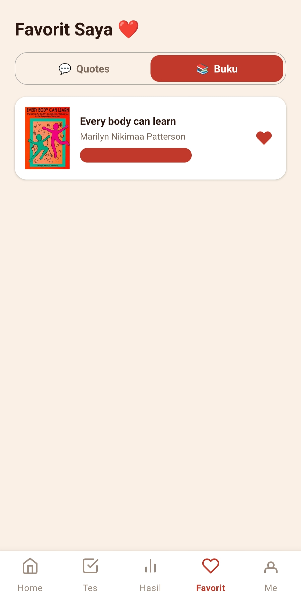
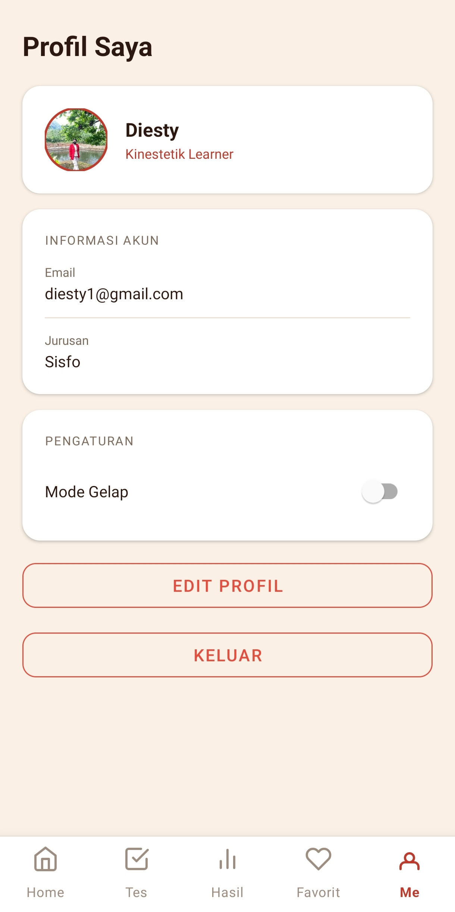
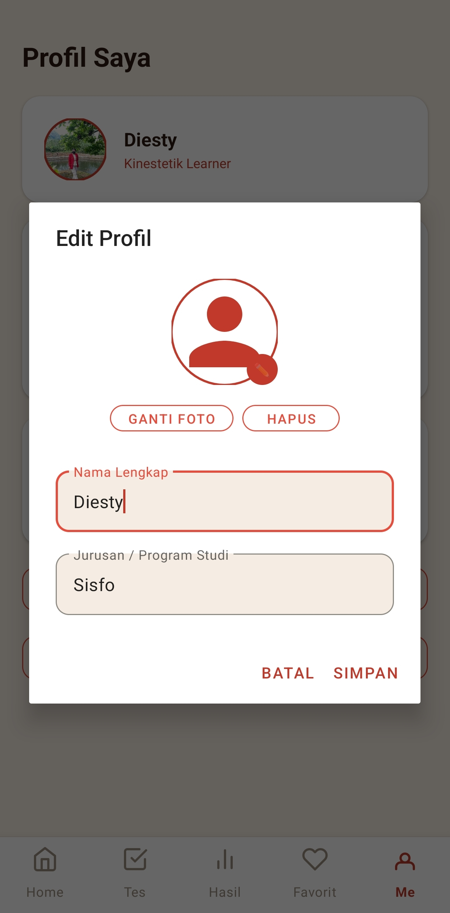

# 📚 StudyStyle

**StudyStyle** adalah aplikasi Android yang dirancang untuk membantu mahasiswa mengenali gaya belajar mereka melalui tes interaktif berbasis model VAK (_Visual, Auditori, Kinestetik_). Setelah menyelesaikan tes 30 soal, pengguna akan mendapatkan hasil dominan gaya belajarnya lengkap dengan grafik persentase pie chart, kutipan motivasi harian, rekomendasi buku bacaan yang sesuai, serta saran metode belajar yang relevan. Aplikasi ini juga dilengkapi fitur login/registrasi, riwayat hasil tes, favorit kutipan & buku, dark mode, dan manajemen profil pengguna.

---

## 📸 Tampilan Aplikasi

| Splash                       | Home                     | Hasil & Riwayat Tes                    |
| ---------------------------- | ------------------------ | -------------------------------------- |
|  |  |  |

| Rekomendasi Buku                                 | Detail Buku                            | Mode Gelap                           |
| ------------------------------------------------ | -------------------------------------- | ------------------------------------ |
|  |  |  |

| Favorit Kutipan                    | Favorit Buku                     | Profil                       | Edit Profil                            |
| ---------------------------------- | -------------------------------- | ---------------------------- | -------------------------------------- |
|  |  |  |  |

---

## ✨ Fitur

| No  | Fitur                        | Deskripsi                                                                                    |
| --- | ---------------------------- | -------------------------------------------------------------------------------------------- |
| 1   | **Tes Gaya Belajar VAK**     | Kuis 30 pertanyaan untuk menentukan gaya belajar Visual, Auditori, atau Kinestetik           |
| 2   | **Hasil & Grafik Pie Chart** | Menampilkan persentase skor tiap gaya belajar dalam bentuk pie chart interaktif              |
| 3   | **Kutipan Motivasi Harian**  | Menampilkan 3 kutipan motivasi dari ZenQuotes API, dapat disimpan ke favorit                 |
| 4   | **Rekomendasi Buku**         | Menampilkan rekomendasi buku dari Open Library API sesuai gaya belajar pengguna              |
| 5   | **Detail Buku**              | Halaman detail buku lengkap dengan sinopsis, author, dan cover dari Open Library             |
| 6   | **Favorit Kutipan & Buku**   | Simpan kutipan dan buku favorit secara lokal menggunakan SharedPreferences                   |
| 7   | **Riwayat Hasil Tes**        | Menyimpan semua hasil tes sebelumnya ke database SQLite lokal                                |
| 8   | **Login & Registrasi**       | Sistem autentikasi pengguna dengan penyimpanan data lokal di SQLite                          |
| 9   | **Manajemen Profil**         | Edit nama, jurusan, foto profil (upload/hapus), dan lihat gaya belajar dominan               |
| 10  | **Dark Mode**                | Toggle dark mode dengan tema merah gelap (`#2A0A08`) via Material Design night theme         |
| 11  | **Penanganan Offline**       | Deteksi koneksi internet; menampilkan pesan offline dan tombol retry saat tidak ada jaringan |
| 12  | **Cache Kutipan**            | Kutipan terakhir di-cache di SharedPreferences sebagai fallback saat offline                 |

---

## 🛠️ Spesifikasi Teknis

| Komponen              | Detail                                                      |
| --------------------- | ----------------------------------------------------------- |
| **Bahasa**            | Java                                                        |
| **IDE**               | Android Studio                                              |
| **Min SDK**           | API 24 (Android 7.0 Nougat)                                 |
| **Target SDK**        | API 36                                                      |
| **Compile SDK**       | API 36                                                      |
| **Version Name**      | 1.0                                                         |
| **Package Name**      | `com.example.studystyle`                                    |
| **Database**          | SQLite (via SQLiteOpenHelper)                               |
| **Penyimpanan Lokal** | SharedPreferences                                           |
| **Arsitektur UI**     | Single Activity + Multiple Fragments (Navigation Component) |

---

## 📦 Teknologi yang Digunakan

| Teknologi / Library            | Versi    | Kegunaan                                                     |
| ------------------------------ | -------- | ------------------------------------------------------------ |
| **Retrofit 2**                 | 2.9.0    | HTTP client untuk konsumsi REST API                          |
| **OkHttp Logging Interceptor** | 4.12.0   | Logging request/response API                                 |
| **Gson**                       | 2.10.1   | Parsing JSON dari response API                               |
| **Navigation Component**       | 2.7.7    | Navigasi antar fragment                                      |
| **RecyclerView**               | 1.3.2    | Menampilkan daftar pertanyaan, buku, riwayat                 |
| **MPAndroidChart**             | 3.1.0    | Menampilkan pie chart persentase gaya belajar                |
| **Glide**                      | 4.16.0   | Memuat gambar cover buku dari URL                            |
| **Lottie**                     | 6.3.0    | Animasi loading dan splash screen                            |
| **CircleImageView**            | 3.1.0    | Foto profil berbentuk lingkaran                              |
| **SwipeRefreshLayout**         | 1.1.0    | Fitur tarik-untuk-refresh di beberapa halaman                |
| **Material Design**            | 1.12.0   | Komponen UI modern (SwitchMaterial, CardView, dll.)          |
| **SQLite**                     | Built-in | Penyimpanan data user dan riwayat hasil tes                  |
| **SharedPreferences**          | Built-in | Penyimpanan sesi login, favorit, cache kutipan, dark mode    |
| **ExecutorService**            | Built-in | Operasi background thread (BackgroundTask + ExecutorManager) |
| **ViewBinding**                | Built-in | Binding view tanpa `findViewById`                            |

---

## 🌐 API yang Digunakan

| API                         | Base URL                          | Kegunaan                                                  | API Key          |
| --------------------------- | --------------------------------- | --------------------------------------------------------- | ---------------- |
| **ZenQuotes API**           | `https://zenquotes.io/`           | Mengambil kutipan motivasi acak (`/api/random`)           | Tidak diperlukan |
| **Open Library Search API** | `https://openlibrary.org/`        | Mencari buku berdasarkan gaya belajar (`/search.json`)    | Tidak diperlukan |
| **Open Library Works API**  | `https://openlibrary.org/`        | Mengambil detail & sinopsis buku (`/works/{workId}.json`) | Tidak diperlukan |
| **Open Library Covers API** | `https://covers.openlibrary.org/` | Mengambil gambar cover buku                               | Tidak diperlukan |

> Semua API yang digunakan bersifat **gratis dan tidak memerlukan API key**.

---

## 📱 Cara Penggunaan

1. **Buka aplikasi** — Splash screen muncul, lalu diarahkan ke halaman login atau registrasi
2. **Registrasi / Login** — Buat akun baru atau masuk dengan akun yang sudah ada
3. **Halaman Home** — Lihat sapaan, status gaya belajar terakhir, dan 3 kutipan motivasi harian
4. **Simpan kutipan favorit** — Ketuk ikon hati ❤️ pada kartu kutipan untuk menyimpannya
5. **Mulai tes** — Buka tab **Tes**, jawab 30 pertanyaan, lalu ketuk tombol **Submit**
6. **Lihat hasil** — Buka tab **Hasil** untuk melihat gaya belajar dominan, persentase pie chart, kelebihan & kekurangan, riwayat tes sebelumnya, dan rekomendasi buku
7. **Simpan buku favorit** — Ketuk ikon hati pada kartu buku untuk menyimpannya
8. **Lihat detail buku** — Ketuk kartu buku untuk membuka halaman detail lengkap dengan sinopsis dan cover
9. **Buka favorit** — Tab **Favorit** menampilkan semua kutipan dan buku yang tersimpan
10. **Kelola profil** — Tab **Profil** untuk melihat info akun, mengganti foto profil, dan mengaktifkan dark mode
11. **Ganti tema** — Aktifkan toggle Dark Mode di halaman Profil untuk beralih tema

---

## 🏗️ Struktur Project

```
StudyStyle/
├── app/
│   ├── src/
│   │   └── main/
│   │       ├── java/com/example/studystyle/
│   │       │   ├── activities/
│   │       │   │   ├── SplashActivity.java          # Launcher & splash screen (3 detik)
│   │       │   │   ├── AuthActivity.java             # Container autentikasi (auth flow)
│   │       │   │   ├── LoginActivity.java            # Halaman login pengguna
│   │       │   │   ├── RegisterActivity.java         # Halaman registrasi akun baru
│   │       │   │   ├── MainActivity.java             # Activity utama + BottomNavigationView
│   │       │   │   └── BookDetailActivity.java       # Halaman detail buku dari Open Library
│   │       │   │
│   │       │   ├── fragments/
│   │       │   │   ├── HomeFragment.java             # Sapaan, status belajar, kutipan motivasi
│   │       │   │   ├── TestFragment.java             # Kuis 30 soal gaya belajar VAK
│   │       │   │   ├── ResultFragment.java           # Hasil tes, pie chart, riwayat, buku
│   │       │   │   ├── FavoriteFragment.java         # Daftar kutipan & buku favorit
│   │       │   │   └── ProfileFragment.java          # Profil, edit data, dark mode toggle
│   │       │   │
│   │       │   ├── adapters/
│   │       │   │   ├── QuestionAdapter.java          # RecyclerView untuk soal tes
│   │       │   │   ├── BookAdapter.java              # RecyclerView untuk rekomendasi buku
│   │       │   │   ├── FavoriteBookAdapter.java      # RecyclerView untuk buku favorit
│   │       │   │   ├── FavoriteQuoteAdapter.java     # RecyclerView untuk kutipan favorit
│   │       │   │   └── HistoryAdapter.java           # RecyclerView untuk riwayat hasil tes
│   │       │   │
│   │       │   ├── api/
│   │       │   │   ├── ApiClient.java                # Retrofit instance (Quote & Books)
│   │       │   │   ├── ApiService.java               # Interface endpoint ZenQuotes API
│   │       │   │   └── BookApiService.java           # Interface endpoint Open Library API
│   │       │   │
│   │       │   ├── background/
│   │       │   │   ├── BackgroundTask.java           # Interface untuk background operation
│   │       │   │   └── ExecutorManager.java          # Manajemen ExecutorService & Handler
│   │       │   │
│   │       │   ├── database/
│   │       │   │   ├── DatabaseHelper.java           # SQLiteOpenHelper (CRUD user & hasil)
│   │       │   │   └── ResultContract.java           # Kontrak tabel User & Result di SQLite
│   │       │   │
│   │       │   ├── models/
│   │       │   │   ├── User.java                     # Model data pengguna
│   │       │   │   ├── Question.java                 # Model soal tes VAK
│   │       │   │   ├── Quote.java                    # Model kutipan motivasi
│   │       │   │   ├── Result.java                   # Model hasil tes
│   │       │   │   ├── BookItem.java                 # Model item buku dari Open Library
│   │       │   │   ├── BookSearchResponse.java       # Model response pencarian buku
│   │       │   │   └── BookDetail.java               # Model detail buku (sinopsis, dll.)
│   │       │   │
│   │       │   └── utils/
│   │       │       ├── Constants.java                # Konstanta URL, key, query buku
│   │       │       ├── NetworkUtil.java              # Cek koneksi internet (ConnectivityManager)
│   │       │       ├── PreferenceManager.java        # Wrapper SharedPreferences (sesi, foto, dll.)
│   │       │       └── ThemeHelper.java              # Terapkan dark/light mode via AppCompatDelegate
│   │       │
│   │       ├── res/
│   │       │   ├── anim/                             # Animasi transisi fragment
│   │       │   ├── drawable/                         # Vector drawable & background XML
│   │       │   ├── layout/
│   │       │   │   ├── activity_splash.xml
│   │       │   │   ├── activity_main.xml
│   │       │   │   ├── activity_login.xml
│   │       │   │   ├── activity_register.xml
│   │       │   │   ├── activity_book_detail.xml
│   │       │   │   ├── fragment_home.xml
│   │       │   │   ├── fragment_test.xml
│   │       │   │   ├── fragment_result.xml
│   │       │   │   ├── fragment_favorite.xml
│   │       │   │   ├── fragment_profile.xml
│   │       │   │   ├── dialog_edit_profile.xml
│   │       │   │   ├── item_book.xml
│   │       │   │   ├── item_favorite_book.xml
│   │       │   │   ├── item_favorite_quote.xml
│   │       │   │   ├── item_history.xml
│   │       │   │   └── item_question.xml
│   │       │   ├── menu/
│   │       │   │   └── bottom_nav_menu.xml           # Menu navigasi bawah (4 tab)
│   │       │   ├── navigation/
│   │       │   │   └── nav_graph.xml                 # Navigation graph semua fragment
│   │       │   └── values/
│   │       │       ├── attrs.xml                     # Custom attribute (?attr/)
│   │       │       ├── colors.xml                    # Palet warna aplikasi
│   │       │       ├── dimens.xml                    # Dimensi margin & padding
│   │       │       ├── strings.xml                   # String resource
│   │       │       ├── themes.xml                    # Tema light mode
│   │       │       └── themes.xml (night)            # Tema dark mode (deep red #2A0A08)
│   │       │
│   │       └── AndroidManifest.xml
│   │
│   └── build.gradle.kts
│
├── gradle/
│   └── libs.versions.toml
├── build.gradle.kts
└── settings.gradle.kts
```

---

## 🚀 Cara Install

### Cara 1 — Via APK (Mudah)

1. Buka halaman **Releases** di repositori GitHub proyek ini
2. Unduh file `StudyStyle.apk`
3. Pindahkan file APK ke perangkat Android kamu
4. Aktifkan **Install from unknown sources** di Pengaturan → Keamanan → Instal dari sumber tidak dikenal → ON
5. Buka file `StudyStyle.apk` di perangkat → ketuk **Install**
6. Buka aplikasi **StudyStyle**

---

### Cara 2 — Via Source Code (Build Sendiri)

**Persyaratan:**

- Android Studio (versi terbaru)
- Java JDK 11 atau lebih tinggi
- Koneksi internet (untuk sinkronisasi Gradle)

**Langkah-langkah:**

**1. Download source code dari GitHub**

- Klik tombol **Code → Download ZIP**, atau jalankan:
  ```bash
  git clone https://github.com/DiestyyMendila/StudyStyle.git
  ```
- Extract file ZIP ke folder komputer kamu

**2. Buka project di Android Studio**

- Buka Android Studio
- Klik **Open** → pilih folder `StudyStyle` hasil extract
- Tunggu proses **Gradle sync** selesai

**3. Jalankan aplikasi**

- Hubungkan perangkat Android ke komputer via USB
- Aktifkan **Developer Mode** di HP: Pengaturan → Tentang Ponsel → ketuk **Nomor Build** 7x
- Aktifkan **USB Debugging**: Pengaturan → Opsi Pengembang → USB Debugging → ON
- Klik tombol **Run ▶** di Android Studio
- Aplikasi otomatis terinstall di HP

**4. Atau build APK sendiri:**

- Klik **Build → Build APK(s)**
- File APK tersimpan di: `app/build/outputs/apk/debug/StudyStyle.apk`

---

## 👩‍💻 Developer

|           |                                 |
| --------- | ------------------------------- |
| **Nama**  | Diesty Mendila Tappo            |
| **Tema**  | Pendidikan — Tes Gaya Belajar   |
| **API**   | ZenQuotes API, Open Library API |
| **Tahun** | 2026                            |

---

## 📄 Lisensi

Project ini dibuat untuk keperluan Tugas Final Lab Mobile 2026

---
